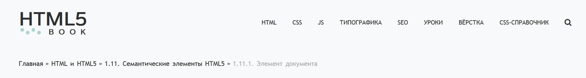
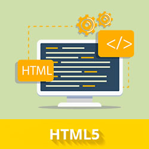

| [HTML5](homework.md) |
| :------------- |
| [1.11. Семантические элементы HTML5](1.11.md) |
| ***1.11.1. Элемент документа*** |
| 1.11.2. ... |
| 1.11.3. ... |
| 1.11.4. ... |

## 1.11.1. Элемент документа

#### Опубликовано: 20 февраля 2020 Обновлено: 16 марта 2020



### Элемент <html>

**Категории содержимого:** нет.

Контекст, в котором этот элемент может быть использован: как корневой элемент HTML-документа. Везде, где разрешен фрагмент поддокумента в составном документе, например, внутри `<iframe>`.

**Пропуск тегов:** начальный тег `<html>` может быть пропущен, если сразу за тегом не идет комментарий. Закрывающий тег `</html>` также может быть пропущен, если перед ним нет комментария.

```html
<!DOCTYPE html>
  <head>
    <title>Тест</title>
  </head>
  <body>
    <h1>Тестовая страница</h1>
  </body>
  ```

  ля элемента доступны <u>‎глобальные атрибуты</u> и атрибут `manifest`, который указывает путь к документу кэша манифеста (в нем перечисляются ресурсы, которые должны быть сохранены в локальном кэше), например:

```html
<html manifest="about_company.appcache">
```

Элемент `<html>` представляет корень HTML-документа (элемент верхнего уровня). Рекомендуется указывать атрибут `lang` с указанием языка документа. Это помогает инструментам синтеза речи для определения произношения, инструментам перевода для определения правил перевода и т.д.

Все остальные элементы должны быть потомками элемента `<html>`. Все, что находится за пределами `<html>...</html>`, не воспринимается браузером как HTML-код и никак им не обрабатывается.

Базовый HTML-документ выглядит так:

```html
<!DOCTYPE html>
<html lang="ru">
  <head>
    <title>Название документа</title>
  </head>
  <body>
    <h1>Заголовок документа</h1>
    <p>Абзац текста.</p>
    <p>
      <a href="another-html-document.html">
        Текстовая ссылка на another-html-document.html
      </a>
    </p>
    <!-- это комментарий -->
  </body>
</html>
```

Над тегом `<html>` в самом начале каждого документа указывается тип документа, который объясняет, какой тип HTML следует ожидать и, следовательно, какие спецификации валидаторов (например, валидатор <u>HTML W3C</u>) должны проверять данный документ.

Тип документа также служит для того, чтобы браузер отображал страницу в так называемом «стандартном режиме». В стандартном режиме браузеры обычно пытаются отобразить страницу в соответствии со спецификациями CSS, то есть предполагается, что документ создан с учетом веб-стандартов.

По материалам <u>The document element</u>