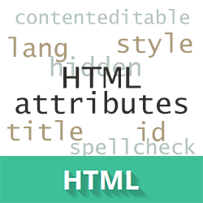

# HTML-атрибуты

HTML-атрибуты сообщают браузеру, каким образом должен отображаться тот или иной элемент страницы. Атрибуты позволяют сделать более разнообразными внешний вид информации, добавляемой с помощью одинаковых тегов.

Значение атрибута заключается в кавычки "". Названия и значения атрибутов не чувствительны к регистру, но, тем не менее, рекомендуется набирать их в нижнем регистре.

---

## Глобальные атрибуты

Глобальные атрибуты, приведенные в таблице ниже, могут быть использованы для любого HTML-элемента, хотя некоторые из них могут не оказывать на элементы никакого влияния.

- [accesskey](#accesskey)
- [class](#class)
- [contenteditable](#contenteditable)
- [dir](#dir)
- [draggable](#draggable)
- [hidden](#hidden)
- [id](#id)

---

#### accesskey

генерирует сочетания клавиш для доступа к текущему элементу. Состоит из разделенного пробелами списка символов. Браузер в первую очередь выбирает те клавиши, которые существуют на раскладке клавиатуры. Применяется к следующим элементам: _a_, _area_, _button_, *input, *label*, *legend*, *textarea*.  
Принимаемые значения: *перечень названий клавиш\*.

#### class

определяет имя класса для элемента (используется для определения класса в таблице стилей).  
Принимаемые значения: _имя класса_.

#### contenteditable

определяет, может ли пользователь редактировать содержимое (контент). Позволяет преобразовать любое поле HTML в редактируемый элемент.  
Принимаемые значения: _true/false_.

#### dir

определяет направление текста контента в элементах _bdo_ и _bdi_.  
Принимаемые значения: _ltr/rtl/auto_.

#### draggable

определяет, может ли пользователь перетащить элемент.  
Принимаемые значения: _true/false/auto_.

#### hidden

указывает на то, что элемент должен быть скрыт.  
Принимаемые значения: _hidden_.

#### id

определяет уникальный идентификатор элемента.  
Принимаемые значения: _id — идентификатор элемента_.

---

[To main menu](index.md)
