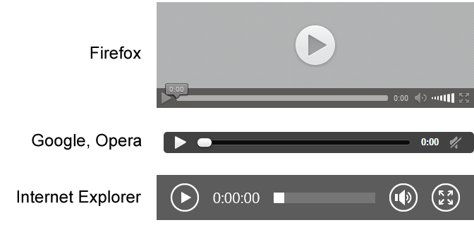

# HTML5-видео

Раньше, если вы хотели добавить видео на веб-страницу, вам приходилось использовать элемент `<object>`, представляющий собой универсальный контейнер для внешних объектов. Подобные приложения были в малой степени интерактивными и слабо взаимодействовали с окружающими их элементами на веб-странице.

Второй подход заключался в использовании подключаемого модуля браузера, например **Silverlight** или **Flash**. И хотя технология **Flash** позволяла использовать готовый видеоплеер или создавать собственный, но её использование порождало большое нагромождение **HTML**-разметки, а видеофайлы нужно было кодировать в требуемый формат.

**HTML5-видео** — новый стандарт для размещения мультимедийных файлов в сети с оригинальным программным интерфейсом без привлечения подключаемых модулей. С помощью элемента `<video>` появилась возможность добавлять видеосодержимое на веб-страницы, а также стилизовать внешний вид видеоплеера при помощи *css*-стилей.



Как добавить HTML5-видео на веб-страницу

Содержание:
1. [Элемент `<video>`](#%d0%ad%d0%bb%d0%b5%d0%bc%d0%b5%d0%bd%d1%82-video)
1. Встраиваемый интерактивный контент `<embed>`
1. Видеокодеки
1. Видеоконтейнеры
1. Альтернативные медиа-ресурсы `<source>`
1. Добавление субтитров и заголовков `<track>`
1. Пример: размещаем видео на сайте
1. Видеоконвертеры

## Элемент <video>

Поддержка браузерами
> IE: 9.0, атрибут muted — с 10.0<br>
Firefox: 3.5<br>
Chrome: 4.0, атрибут muted — с 30.0
Safari: 4.0, атрибут muted — с 5.0
Opera: 11.5
iOS Safari: 3.2
Android Browser: 2.3
Chrome for Android: 44

В простом варианте HTML-разметка для размещения видеофайла на странице имеет следующий вид:

`<video src="video.ogv" controls></video>` 
HTML
Атрибут controls отвечает за появление элементов управления видеоплеером. Вы можете добавить изображение с помощью атрибута poster, которое браузер будет использовать, пока загружается видео или пока пользователь не нажмет на кнопку воспроизведения, а также задать высоту и ширину видео.

Как и в случае с аудиофайлами, рекомендуется перечислять в <source> все форматы, начиная с более предпочтительного. Также нужно указывать MIME-тип для каждого видеофайла.

``` html
<video controls width="400" height="300">
  <source src="video.mp4" type="video/mp4"><!-- MP4 для Safari, IE9, iPhone, iPad, Android, и Windows Phone 7 -->
  <source src="video.webm" type="video/webm"><!-- WebM/VP8 для Firefox4, Opera, и Chrome -->
  <source src="video.ogv" type="video/ogg"><!-- Ogg/Vorbis для старых версий браузеров Firefox и Opera -->
  <object data="video.swf" type="application/x-shockwave-flash"><!-- добавляем видеоконтент для устаревших браузеров, в которых нет поддержки элемента video -->
    <param name="movie" value="video.swf">
  </object>
</video>
```

HTML
ТАБЛИЦА 1. АТРИБУТЫ ТЕГА <VIDEO>

|Атрибут|Описание, принимаемое значение|
|:---|---|
|autoplay|Автоматическое воспроизведение видеоофайла сразу же после загрузки страницы.|
|controls|Указывает браузеру, что нужно отобразить базовые элементы управления воспроизведением (воспроизведение, пауза, громкость).|
height	Задает высоту окна для отображения видеоданных, возможные значения: px или %
loop	Циклическое воспроизведение видеофайла.
muted	Выключает звук при воспроизведении видеофайла.
poster	URL файла изображения, которое будет отображаться во время загрузки видеофайла или до тех пор, пока пользователь не нажмет на кнопку PLAY. Если атрибут не задан, то будет отображаться первый кадр видеофайла.
preload	Атрибут, отвечающий за предварительную загрузку видеоконтента. Не является обязательным, некоторые браузеры игнорируют его. Возможные значения:
auto — браузер загружает видеофайл полностью, чтобы он был доступен, когда пользователь начнет его воспроизведение.
metadata — браузер загружает первую небольшую часть видеофайла, чтобы определить его основные характеристики.
none — отсутствие автоматической загрузки видеофайла.
src	Содержит абсолютный или относительный URL-адрес видеофайла.
width	Задает ширину окна для отображения видеоданных, возможные значения: px или %