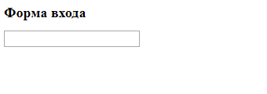
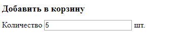
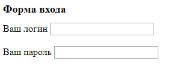
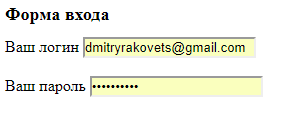
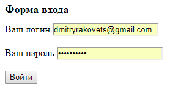
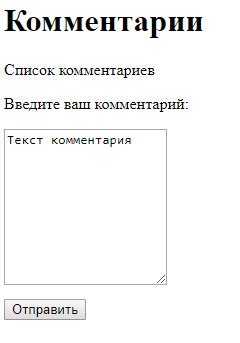
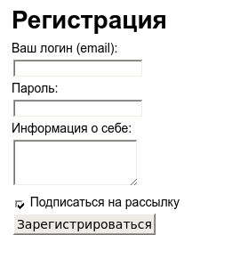
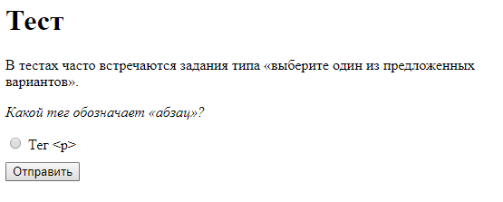
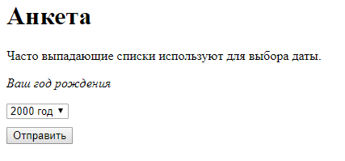
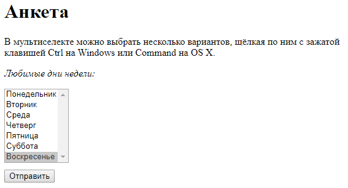

# Формы
Формы нужны для того, чтобы отправлять данные с веб-страницы на веб-сервер, который сможет эти данные обработать: зарегистрировать пользователя, создать сообщение на форуме, отправить письмо и так далее. В общем, формы в вебе просто необходимы.

## Theory
[Forms](https://github.com/rakavets/html-coding/wiki/Forms#forms)

## Statement of work 1
- Добавьте на страницу пустую форму,
- затем задайте ей адрес отправки `https://it-academy.by`
- и метод отправки данных — `post`.

## Statement of work 2
- Добавьте в форму поле ввода с помощью тега `<input>`,
- задайте ему тип `text`
- и имя `login`.
### Result

## Statement of work 3
- Добавьте текстовому полю идентификатор `total-field`
- и значение по умолчанию `5`.
### Result

## Statement of work 4
- Оберните подпись Ваш логин и текстовое поле внутрь тега `label`
### Result

## Statement of work 5
- Добавьте к полю для ввода логина идентификатор `login-field`
- Оберните текст Ваш логин в тег `label`. Тег `label` должен оказаться внутри тега `td`
- Затем свяжите подпись с полем ввода логина с помощью атрибута `for`
### Result

## Statement of work 6
- Добавьте второе текстовое поле с именем `password` и идентификатором `password-field` после первого поля.
- Добавьте подпись Ваш пароль и свяжите её со вторым полем с помощью атрибута `for`
### Result

## Statement of work 7
- Поменяйте у поля ввода пароля тип поля на password.
### Result

## Statement of work 8
- Добавьте кнопку для отправки формы с надписью `Войти`
- а затем отправьте форму.
### Result

## Statement of work 9
- Добавьте в форму многострочное текстовое поле с именем `comment` и идентификатором `comment-field`
- Задайте этому полю высоту `10` строк
- И исходное значение `Текст комментария`
### Result

## Statement of work 10
- Добавьте в форму чекбокс с именем `subscribe` и идентификатором `subscribe-field`
- Сделайте, чтобы галочка в чекбоксе стояла по умолчанию
### Result

## Statement of work 11
Сверстать форму как на изображении в *Result*
### Result

## Statement of work 12
- Добавьте в форму переключатель с именем `question-one`
- Задайте переключателю значение `p`
### Result

## Statement of work 13
- Добавьте в форму второй переключатель с именем `question-one` и значением `b`
- Сделайте его выбранным по умолчанию
### Result

## Statement of work 14
- Добавьте в форму раскрывающийся список с именем `year`
- Добавьте в этот список вариант со значением `2000` и подписью `2000 год`
- И второй вариант со значением `2001` и подписью `2001 год`
### Result

## Statement of work 15
- Сделайте раскрывающийся список мультиселектом
- Увеличьте его размер до `7`
- Сделайте, чтобы по умолчанию было отмечено `воскресенье`
### Result

## Statement of work 16
- Задайте для формы атрибут `enctype` необходимый для загрузки файлов
- Добавьте поле для загрузки файлов с именем `avatar`
### Result

## Statement of work 17
- Добавьте скрытое поле с именем `account_number` и значением `15`
- Отправьте форму и посмотрите, какие данные были переданы.

## Statement of work 18
Сверстать форму как на изображении в *Result*
### Result
