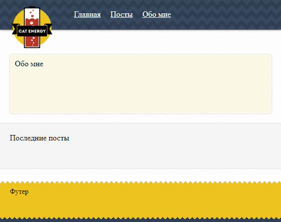
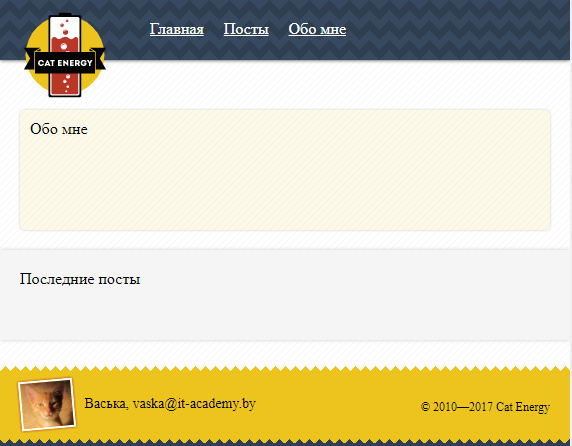
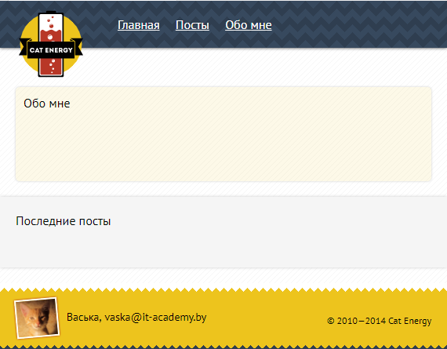
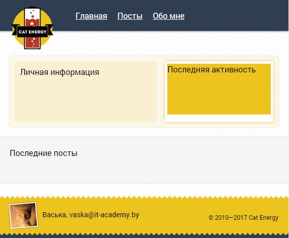
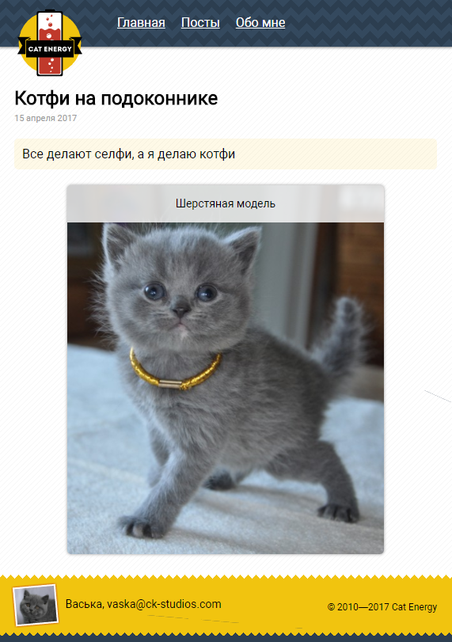
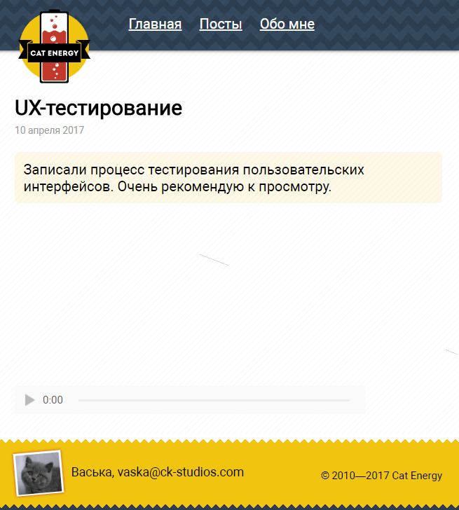
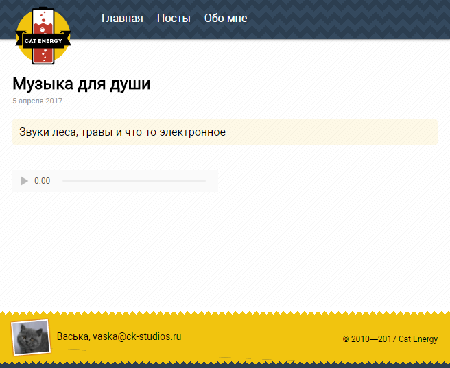
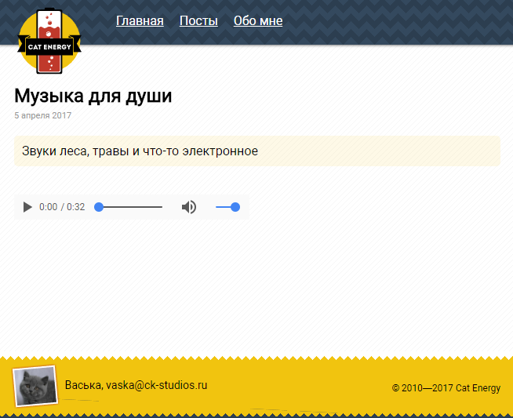
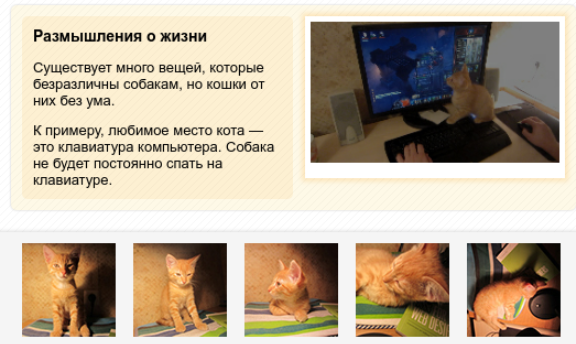

# Семантическая структура страницы

## Theory
[Semantic page structure](https://github.com/rakovets/html-coding/wiki/Semantic-page-structure)

## Statement of work 1
Добавить:
- в `body` элемент `header` с классом `page-header` и текстом `Хедер`
- элемент `footer` с классом `page-footer` и текстом `Футер`
### Result

## Statement of work 2
Добавить:
- между хедером и футером элемент `main` c текстом `Основное содержание`
### Result

## Statement of work 3
Удалить:
- текст из `main`

Добавить:
- внутрь `main` тег `article` с классом `about-me` и текстом `Обо мне`
- тег `section` с классом `posts` и текстом `Последние посты`
### Result

## Statement of work 4
Добавить:
- в хедер `div` с классом `logo`
- внутрь дива изображение с адресом `/images/logo.svg`, шириной и высотой `90` пикселей

Увеличить:
- ширину и высоту этого изображения до `300` пикселей, размеры изображения задавать с помощью атрибутов тега ``
### Result

## Statement of work 5
Добавить:
- в хедер после логотипа тег `nav` с классом `main-menu`
- внутрь `nav` неупорядоченный список из 3 пунктов: `Главная`, `Посты`, `Обо мне`
- ссылку с произвольным адресом для текста каждого пункта
### Result

## Statement of work 6
Добавить:
- `section` с классом `info` для фото кота, его имени и адрес почты
- `section` с классом `copyright` для информации о копирайте
### Result

## Statement of work 7
Раскомментировать:
- тег `link` внутри `head`

Задать:
- для `body` шрифт `"PT Sans", "Arial", sans-serif`
### Result

## Statement of work 8
Удалить:
- тег `link` внутри `head`

Раскомментировать:
- правило `@font-face` в `CSS`

Задать:
- для `body` шрифт `Roboto`
### Result

## Statement of work 9
Удалить:
- текст из раздела `about-me`

Добавить:
- внутрь `about-me` тег `section` с классом `profile` и текстом `Личная информация`
- после блока `.profile`  тег `aside` с классом `last-actions` и текстом `Последняя активность`
### Result

## Statement of work 10
Удалить:
- текст из раздела `posts`

Добавить:
- внутрь `posts` тег `article` с классом `featured-post`
- внутрь `featured-post` тег `header`
- в `header` тег `h1` с текстом `Заголовок поста`
- сразу после тега `header` тег `section` c текстом `Анонс поста`
### Result

## Statement of work 11
Раскомментируйте код в разделах:
- `profile`
- `last-actions`
- `featured-post`
### Result

## Statement of work 12
Добавить:
- внутрь основного содержания статью с классом `post`
- внутрь статьи хедер, а внутрь него заголовок первого уровня с текстом `Заголовок поста`
- сразу после хедера раздел с классом `intro` и текстом `Введение`
- после раздела `intro` раздел с классом `content` и текстом `Содержание поста`
### Result

## Statement of work 13
Добавить:
- дату публикации в хедер поста после заголовка. Значение даты для людей 21 апреля 2017, а для машин 2017-04-21T11:00:00.

Раскомментировать:
- код введения поста.
- код содержания поста.
### Result

## Statement of work 14
Добавить:
- в содержание поста тег `figure`
- внутрь него вставьте изображение с адресом `images/catmod.jpg`
- подпись с текстом `Шерстяная модель`
### Result

## Statement of work 15
Добавить:
- в содержание поста тег `video`

Включить:
- у видео управляющую панель
- предзагрузку мета-информации,

Задать:
- видеоролику ширину `400` и высоту `225` пикселей.
### Result

## Statement of work 16
Добавить:
- в видео первый источник с типом `video/mp4` и адресом `videos/rendering.mp4`
- второй с типом `video/ogg` и адресом `videos/rendering.ogv`
- третий с типом `video/webm` и адресом `videos/rendering.webm`
### Result

## Statement of work 17
Добавить:
- в содержание поста тег `audio`

Включить:
- управляющую панель у тега `audio`
- предзагрузку мета-информации у тега `audio`
### Result

## Statement of work 18
Добавить:
- в аудио первый источник с типом `audio/mpeg` и адресом `sounds/sound.mp3`
- второй с типом `audio/ogg` и адресом `sounds/sound.ogg`
### Result

## Statement of work 19
Реализовать:
- верстку с использование макета `result`
### Result
