# Введение в **CSS**
Во всех заданиях необходимо "подключить" **CSS**.

## Theory
Теоритический материал

## Statement of work 1
Раскомментировать:
- код в **CSS**, удалив символы `/*` и `*/`
### Result
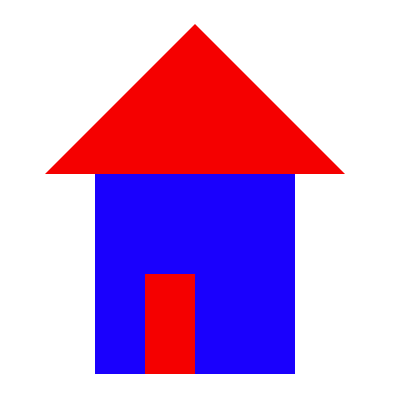

## Statement of work 2
Создать:
- **CSS**-правило для абзацев со свойством `color: #999999;`
- **CSS**-правило для заголовков 1 уровня со свойством `font-family: Tahoma;`
- **CSS**-правило для заголовков 2 уровня со свойством `color: #0088cc;`
### Result
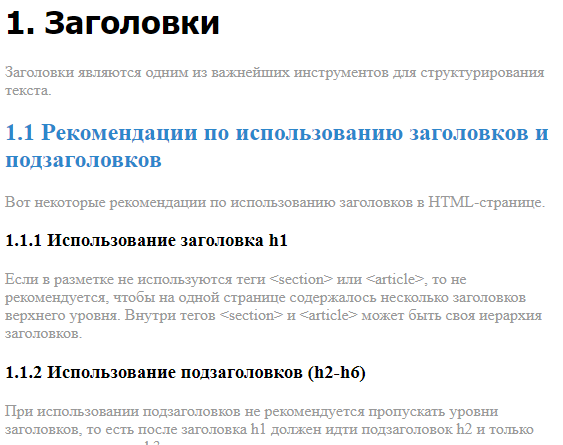

## Statement of work 3
Создать:
- **CSS**-правило для выделения ошибок и примените его к элементам с ошибками

Добавить:
- **CSS**-правило для класса `error` со свойством `color: red;`
- класс `error` к третьему элементу списка
- класс `error` к второму абзацу
### Result
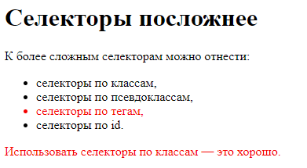

## Statement of work 4
Добавить:
- в **CSS**-правило для класса `underline` свойство `text-decoration: underline;`
- в **CSS**-правило для класса `bold` свойство `font-weight: bold;`
- в **CSS**-правило для класса `italic` свойство `font-style: italic;`
### Result
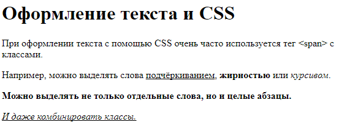

## Statement of work 5
Добавить:
- в **CSS**-правило для класса `p-first` свойство `margin-left: 50px;`
- в **CSS**-правило для класса `p-second` свойство `padding: 20px;`
- в **CSS**-правило для класса `p-third` свойство `width: 50%;`
### Result
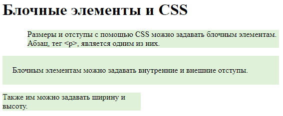

## Statement of work 6
Добавить:
- в **CSS**-правило для класса `p-absolute` свойство `position: absolute;`
- в **CSS**-правило для класса `p-absolute` свойство `left: 100px;`
- в **CSS**-правило для класса `p-absolute` свойство `bottom: 200px;`
### Result
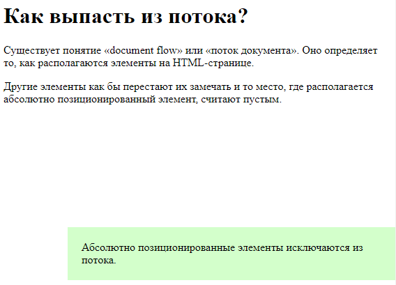

## Statement of work 7
Дбавить:
- в **CSS**-правило для класса `left-column` свойство `float: left;`
- в **CSS**-правило для `right-column` свойство `float: right;`
- в **CSS**-правило для `footer` свойство `clear: both;`
### Result
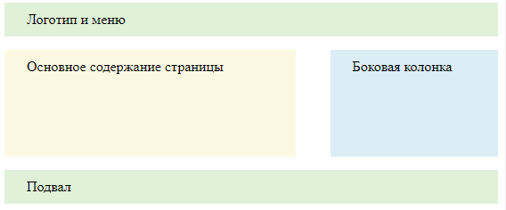

## Statement of work 8
Добавить:
- в **CSS**-правило для класса `alert` свойство `background-color: #dff0d8;`
- в **CSS**-правило для класса `alert` свойство `color: #468847;`
- в **CSS**-правило для класса `alert` свойство `border-radius: 5px;`
### Result
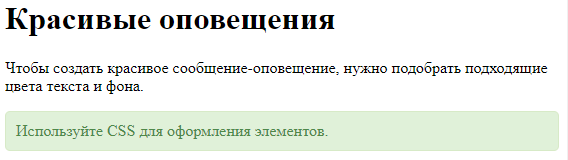

## Statement of work 9
Добавить:
- в **CSS**-правило для тега `p` свойство `padding: 10px;`
- в **CSS**-правило для класса `truth` свойство `background-color: #dff0d8;`
- в **HTML** добавьте класс `truth` второму абзацу
### Result
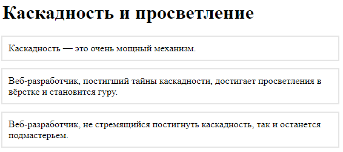

## Statement of work 10
Задать:
- цвет фона для **CSS**-правил по аналогии с предыдущим заданием
- для всех `p` задайте цвет фона `#dff0d8`
- для класса `truth` задайте цвет фона `#aaddff`
### Result
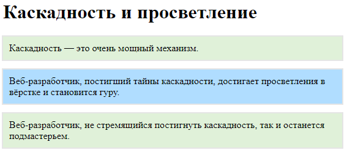

## Statement of work 11
Изменить:
- порядок **CSS**-правил так, чтобы фон третьего абзаца стал зелёным (в задании нельзя менять **HTML**. Первому абзацу задан класс `blue`, второму — `green`, а у третьего абзаца сразу два класса — `blue` и `green`)
### Result
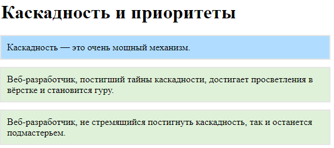

## Statement of work 12
Добавить:
- каждому абзацу класс `nice-box`
- в **CSS**-правиле для `nice-box` измените свойство `border-radius: 15px;`
### Result

## Statement of work 13
Задать:
- для `body` свойство `color: red;`
- для `ul` свойство `font-style: italic;`
### Result
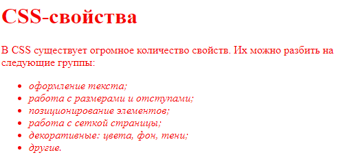

## Statement of work 14
Задать:
- для `body` свойство `padding: 20px;`
- для `ul` свойство `border: 1px solid #cccccc;`
- для `ul` свойство `padding: 30px;`
### Result
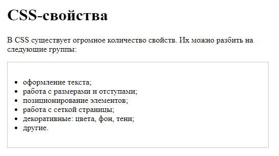

## Statement of work 15
Реализовать:
- верстку, с использованием макета
### Result
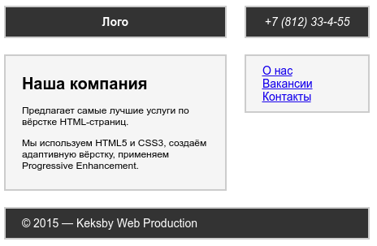