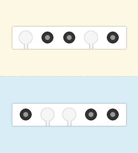

# Селекторы
Для всех заданий необходимо создать `task${number-statement}.css` и подключить его к html-файлу. Кроме этого менять разметку запрещено.

## Theory
[Селекторы](https://github.com/rakovets/html-coding/wiki/Селекторы)

## Statement of work 1
Добавить:
- к каждому элементу списка атрибут `style` со свойством `background-color: red;`

## Statement of work 2
Сделать:
- каждый элемент списка красным светом с использованием CSS

## Statement of work 3
Задать:
- свойство `background-color: red;` для класса `red`
- свойство `background-color: green;` для класса `green`

## Statement of work 4
Задать:
- свойство `background-color: red;` для 1-2 пункта меню
- свойство `background-color: yellow` для 3-4 пункта меню
- свойство `background-color: green` для 5-6 пункта меню

## Statement of work 5
Задать:
- различные цвета для 1-5 пункта списков, но в одном из списов они `light`, во втором `dark` 

## Statement of work 6
Задать:
- свойство `background-color: red;` для 2, 4 пункта меню 

## Statement of work 7
Задать:
- свойство `background-color: darkred;` для 4 пункта меню `class="dark"`
- свойство `background-color: yellow;` для 4 пункта меню `class="normal"`
- свойство `background-color: red;` для 2 пункта меню `class="normal"`

## Statement of work 8
Исправьте таблицу результатов по биатлону:
- нижние рамки должны остаться только у элементов списка первого уровня
- выделение жирным должно остаться только у фамилий

## Statement of work 9
Задать:
- свойство `background-color: red;` для 1 пункта меню 
- свойство `background-color: yellow;` для 5 пункта меню 

## Statement of work 10
Задать:
- свойство `background-color: red;` для 3 и 4 пункта меню 

## Statement of work 11
Задать:
- свойство `background-color: red;` для 2 и 4 пункта `list-1` и 1 пункта `list-2` 

## Statement of work 12
Усовершенствуйте таблицу результатов, добавив подсветку строк и очков:
- в CSS-правило с селектором `tr:hover` добавьте свойство `background-color: #fcf8e3;`
- в `strong:hover` свойство `color: #0088cc;`

## Statement of work 13
Cделать так, чтобы при наведении на строку таблицы:
- появлялась страна: свойство `display: inline;`
- подсвечивались очки: свойство `color: #0088cc;`

## Statement of work 14
Задать:
- ещё не посещённым ссылкам цвет `color: black;`
- посещённым ссылкам цвет `color: #cccccc;`
- активным ссылкам цвет `color: green;`

## Statement of work 15
Подсветиnm поля в фокусе:
- добавить правило с селектором `form input:focus` и добавите свойство `border-color: #0088cc;`

## Statement of work 16
Задать:
- фон полю с атрибутом `required`: `background-color: #fcf8e3;`
- фон полю для ввода пароля: `background-color: #f2dede;`
- цвет рамок для кнопки: `border-color: green;`

## Statement of work 17
Задать:
- фон полю «Имя»: `background-color: #fcf8e3;`
- ширину полю «Год»: `width: 100px;`

## Statement of work 18
Подобрать:
- нужные селекторы для каждого CSS-правила.

### Result
