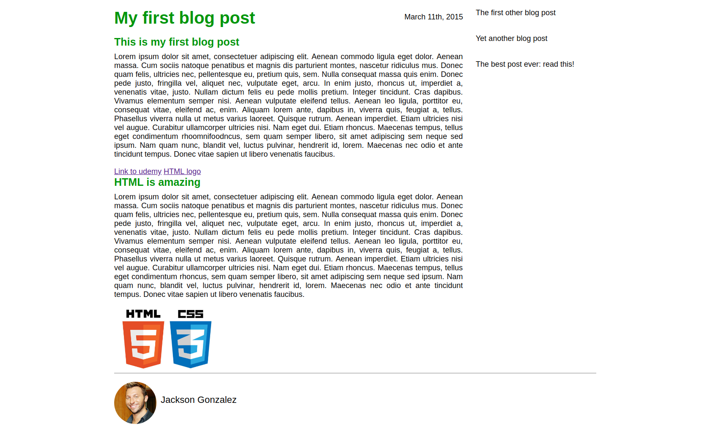

# Верстка блога

## Statement of work
Сверстать web-page:
- создать `index.html`, который содержит `content`
- создать `index.css`, который содержит `style`
- добавить три `images`

Примечание:
- допустимы небольшие отличия в цвете, отступах, шрифте
- не допустимы отличия в размещении ключевых элементов

## Result
